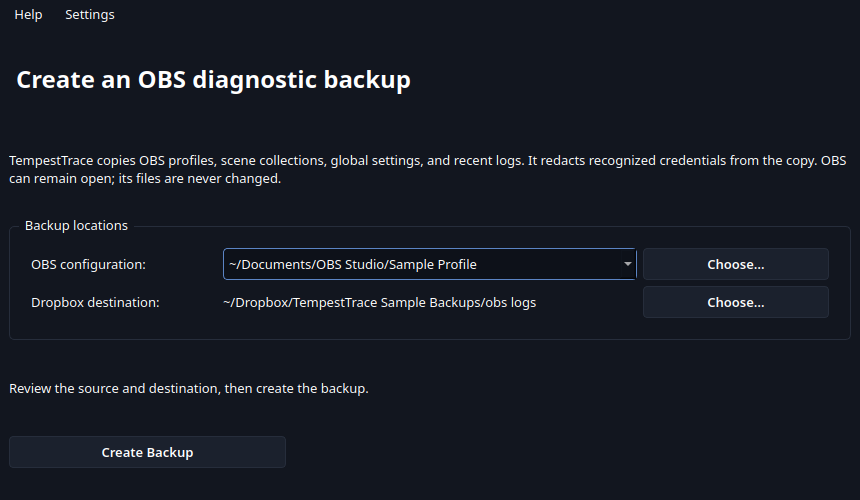
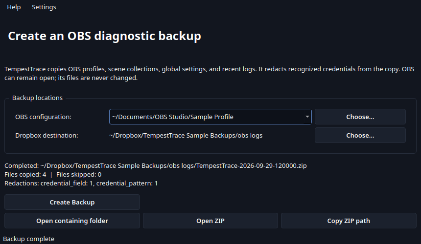

# TempestTrace

TempestTrace is a prototype for a Windows and Linux desktop app that will collect a
safe OBS Studio diagnostic backup for troubleshooting Rin's screen flicker issue.

The [design and implementation plan](docs/DESIGN.md) defines the collection scope,
redaction rules, user flow, tests, and release criteria. The synthetic-fixture
collector, PyQt desktop flow, updater, and Windows/Linux packaging workflows are
implemented. PR CI runs lint and synthetic tests only. After a merge to `master`, CI
builds and smoke-tests the Windows installer and Linux packages, then publishes a
beta prerelease when the full asset matrix and checksums pass. Morgan manually
validates the beta and promotes that same release to stable. Hands-on checks cover
fixture collection, update behavior, sandbox access, and collection while OBS is
streaming.

After lint and tests pass on a master commit, CI creates the next patch tag in the
`v0.1.x` beta series (starting at `v0.1.0`) and builds every platform from that tag.
Package builds are serialized and run only after master merges. Use GitHub's
**Re-run failed jobs** only when a build job actually failed; it reuses that run's tag
and successful platform artifacts. A rerun after success does not rebuild or consume
a version. The next master merge gets the next patch version.

Every successful master build publishes the complete verified asset matrix as a beta
prerelease. Published files are immutable to CI: a retry verifies existing files and
adds only missing assets. Changing a release from prerelease to stable does not affect
that behavior; CI never changes the release's status or replaces existing assets.
Update checks offer stable releases by default. Users can opt into beta updates in
Preferences to include prereleases.

`make test` writes `coverage.xml` and `junit.xml`; CI preserves both reports and
uploads coverage and test results to Codecov. Ruff and mypy are the lint checks;
pytest runs the tests. Master requires green `Lint & Test`, `codecov/project`, and
`codecov/patch` checks. Dependabot PRs are set to squash auto-merge after those
checks pass and review conversations are resolved.

To enable Dependabot auto-merge, add a repository **Dependabot secret** named
`DEPENDABOT_MERGE_TOKEN` under Settings → Secrets and variables → Dependabot. Use a
dedicated token with Contents and Pull requests write access to this repository.
The workflow uses this token so Dependabot merges trigger the master release CI.

## Intended use

Rin can install the NSIS setup package and launch TempestTrace, then review the
proposed output location and start a read-only collection.
Linux users can use native packages with the same collection and redaction behavior.
Amd64 and arm64 Linux packages are built on Ubuntu 24.04. DEB, RPM, and AppImage
require glibc 2.39 or newer; Flatpak and Snap use their pinned runtimes. RPM is
smoke-tested on Fedora 42. Flatpak and Snap are sideloaded packages without a
configured remote or store channel; Snap requires `sudo snap connect
tempesttrace:obs-config` for OBS configuration access.
A successful run will leave a single, timestamped ZIP file under
`Dropbox/Jasmeralia and Rin/obs logs/` containing sanitized OBS
profiles, scene collections, recent logs, and a readable manifest. The utility will
never stop OBS or change its source files.

The collector copies an explicit set of OBS profile, scene, global settings, and recent
log files; it redacts recognized credential fields and patterns in staged copies,
including RTMP-family stream-key path segments and SRT `passphrase`/`streamid` values, and
writes a timestamped ZIP, README, and manifest. Review skipped files and warnings in
the manifest after collection.

## Screenshots

These screenshots are captured from the real Qt interface using synthetic OBS files
and a temporary Dropbox folder. They contain no real profiles, logs, or credentials.

### Review locations

### Sanitized backup complete

## Development

Install dependencies with `make deps`, launch with `python -m tempesttrace`, and run
the synthetic suite with `make test`. Collection and redaction live outside Qt so path
discovery and backup behavior can be exercised with temporary fixture directories.
Regenerate the README screenshots with `make screenshots` after UI changes.

## Source references

- [OBS Studio profiles](https://obsproject.com/kb/profiles)
- [OBS Studio configuration folder](https://obsproject.com/forum/threads/what-files-hold-the-obs-configuration.74280/)
- [OBS Studio log location](https://obsproject.com/forum/threads/please-post-a-log-with-your-issue-heres-how.23074/)
- [Dropbox folder discovery](https://help.dropbox.com/installs/locate-dropbox-folder)
